# Uso de Custom Exceptions (excepciones personalizadas) en .NET

Las excepciones (exceptions) son un mecanismo incorporado en .NET que ayuda a la detección de condiciones excepcionales en nuestras aplicaciones, entiéndase por condiciones excepcionales aquellas situaciones que están fuera de nuestro control y que no podemos prever como programadores, esto es distinto de los errores de código y de los errores de aplicación ya que estos si son prevenibles y manejables dentro del ciclo de desarrollo. Como ejemplos de condiciones excepcionales tenemos:

<ul>
<li>Conectarse a una base de datos que se encuentra offline.</li>
<li>Conectarse a una base de datos y tratar de ejecutar un store procedure que no existe.</li>
<li>Leer de un archivo en disco que no se encuentra en una determinada ruta.</li>
<li>Convertir una cadena de caracteres o alfanumérica hacia un tipo numérico.</li>
<li>Ejecutar una acción cuando ya no hay memoria disponible en el sistema operativo.</li>
<li>Cuando se hace referencia a un elemento no creado o que se encuentra fuera de los límites de un arreglo.</li>
</ul>

En .NET la técnica para el manejo de estas condiciones se conoce como structured exception handling (SEH) (la traducción sería más o menos manejo estructurado de excepciones) esta técnica a base de bloques es parte integral de .NET y aplicable a cualquier lenguaje que se ejecute en .NET, en esencia parte de dos clases ApplicationException y SystemException que heredan de la clase System.Exception y que agrupan las excepciones en dos categorías, la primera representa excepciones lanzadas por las aplicaciones y la segunda las del CLR, las clases para excepciones incluidas en .NET son derivadas de estas clases que cubren los casos más comunes y para su empleo se usa la combinación de cuatro palabras reservadas: try,catch throw, finally como se detalla a continuación en los pasos siguientes:

1-. Se pone dentro de un bloque try aquel código que podría tener un evento inesperado.

<pre>
try
{
         Paso1();
         Paso2();
         Paso3();
}
</pre>

2-.Al final del bloque try puede ir acompañado o no de varios bloques catch, típicamente aparece la palabra catch con la clase que manejará el error si la palabra catch no especifica una clase entonces atrapara todas las posibles excepciones, cuando se enumeran una a una las posibles condiciones de excepción es MUY IMPORTANTE la jerarquía de clases ya que cada bloque debe ir de la clase más específica a la clase más general, por ejemplo:

<pre>

       catch(NpgsqlException ex){  //derivada de DbExeption
       }
       catch(DbException ex){  //derivada de ExternalException
       }
       catch(ExternalException ex){ //derivada de SystemException
       }
       catch(SystemException ex){ //derivada de Exception
       }
       catch(Exception ex){ //derivada de Exception
       }
</pre>

3-. Dentro de cada uno de los bloques catch se coloca el código para el manejo de la excepción como agregar nueva información a la excepción, establecer valores predeterminados de variables o lo más común aquí es tener un Log o bitácora para registrar la excepción, después hay que reenviar o arrojar la excepción a la clase que ejecuto ese código, hay dos alternativas a esto enviar la excepción tal cuál o bien enviar una excepción personalizada que sea de valor para las capas que llamaron la ejecución del código.

<pre>
        catch(NpgsqlException ex)
        {  //derivada de DbExeption
           EscribeBitacora(ex.Message); 
         }
</pre>

4-. En el bloque finally se coloca el código que siempre será ejecutado haya ocurrido o no una excepción, por lo general en este bloque se coloca código de limpieza (cleanup) por ejemplo se cierran conexiones de red o a bases de datos, se liberan recursos utilizados o se cierran archivos abiertos entre otros usos.

<pre>
      finally {
            CloseConnectionDB();
            CloseNetWorkConnection();
            CloseFileOpenToWrite();
         }
 </pre>
 

Las excepciones no deben ocasionar que la aplicación se colapse por completo por lo que una buena estrategia de desarrollo es manejar las excepciones y responder al evento que las ocasiono. Aunque el uso clases predeterminadas dentro del Framework es adecuado presenta una desventaja por el tipo de mensaje predeterminado ya que para el usuario esa información no debe ser de su conocimiento y en la mayoría de los casos no le encuentra utilidad, por lo que es necesario envolver la excepción dentro una técnica para personalizar excepciones.

<h3>La técnica para el uso personalizado de Excepciones</H3>

.NET permite crear excepciones personalizadas que envuelven las excepciones originales por excepciones que tengan nuevas características como por ejemplo: mensajes más significativos para el usuario, traducciones o que pueden tener información adicional.
Los pasos para crear una excepción personalizada son:

1-. Crear una nueva clase con el sufijo Exception como una buena práctica y recomendación las clases derivadas de Exception utilizan el este sufijo.

<pre>

     class RuntimeException
     {
      }
</pre>

2-. Derivar esta clase de ApplicationException, aunque se podría derivar directamente de Exception, no se considera una buena práctica.

<pre>
     class RuntimeException : ApplicationException 
     {
      }
</pre>

3-. La clase debe de tener tres constructores dos adicionales al constructor predeterminado o vacio, como se muestra en el siguiente código:

<pre>
     public class RuntimeException : ApplicationException
     {
      public RuntimeException(string message): base(message){ }
      public RuntimeException(string message, Exception inner): base(message, inner){}
      }
</pre>

Como ejemplo de estos conceptos vamos a crear una aplicación que se conecta a una base de datos PostgreSQL, lee y muestra los registros de una tabla llamada Books y donde hace uso de dos excepciones personalizadas: DataBaseException y RuntimeException.

En Monodevelop o en Visual Studio creamos una aplicación de consola, como en las siguientes imágenes.

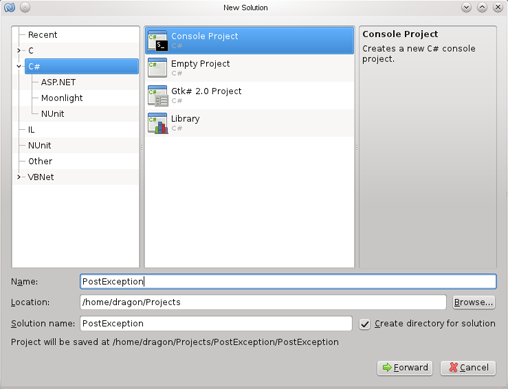
Creamos una base de datos en <b>PostgreSQL</b> llamada curry y una tabla llamada Books que tendrá los campos como en la siguiente imagen:
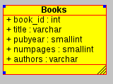

Aquí el Script de creación de la tabla

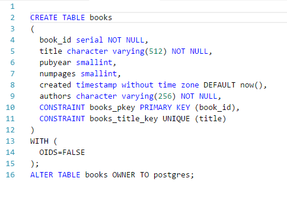

Una vez creada la base de datos y el proyecto, creamos la siguiente clase de entidad.

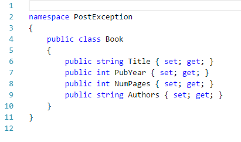

Las clases derivadas y personalizadas que muestran con los constructores básicos del manejo de excepción.
La clase que maneja las excepciones en base de datos

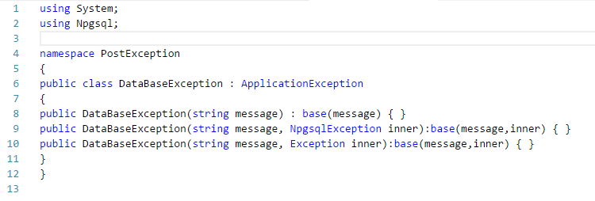

La clase que maneja las excepciones de la aplicación.

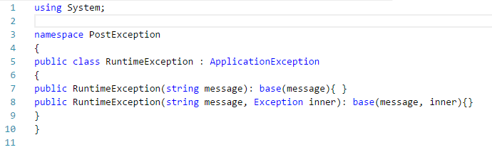

La clase de acceso a datos

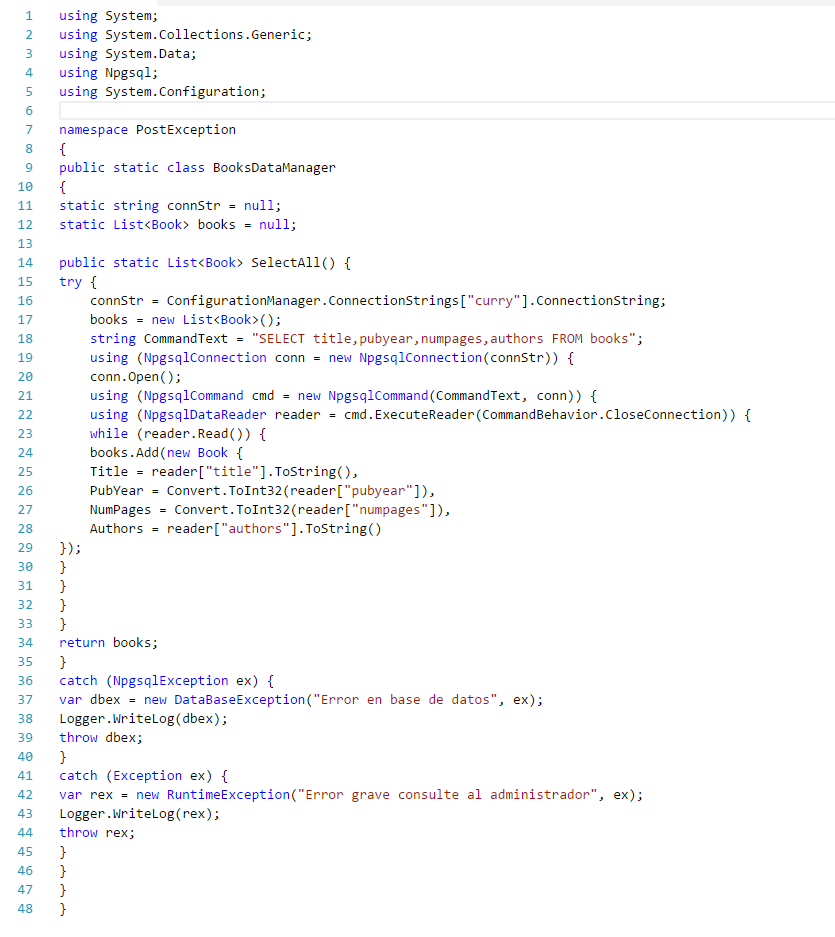

La clase logger que se encargara de registrar las excepciones.

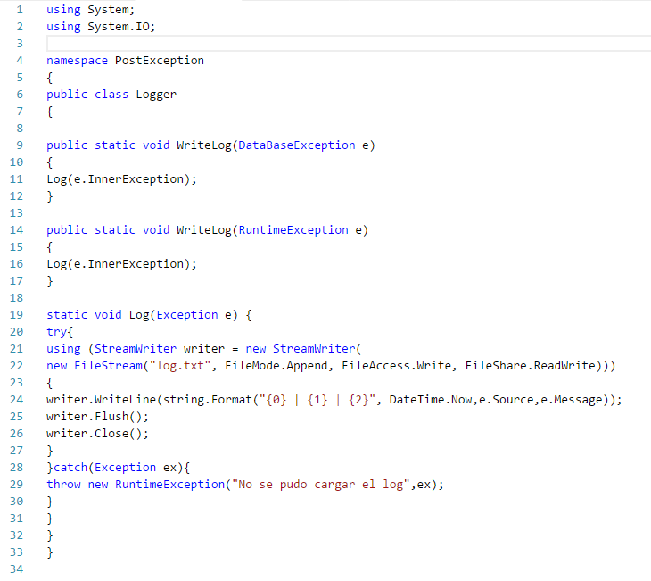

Por último la clase principal en donde usamos las excepciones personalizadas.

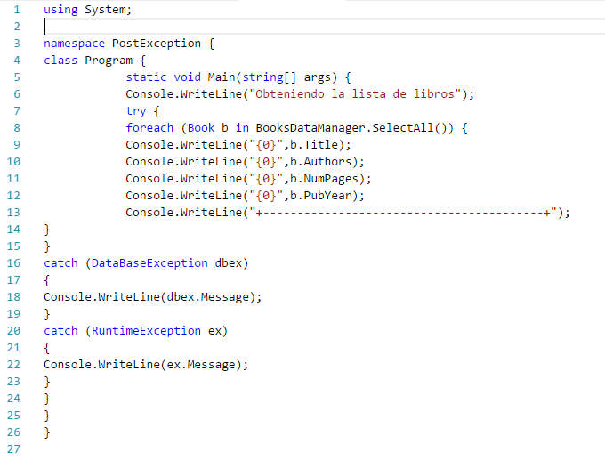

Una vez creadas estas clases dentro del proyecto la estructura se verá más o menos así en MonoDevelop

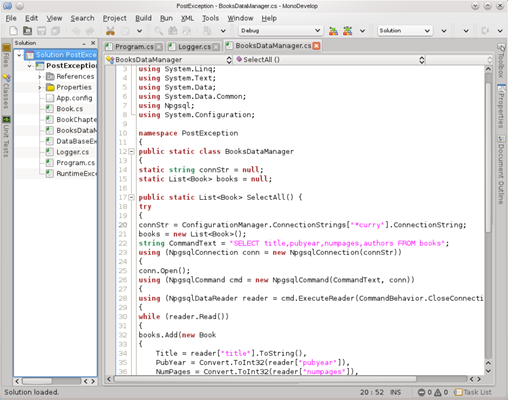

Para ejecutar este programa siendo una aplicación de consola debemos de habilitar la salida en una terminal independiente en el menú Project del menú principal elegimos la opción Project properties donde nos aparece la siguiente ventana.

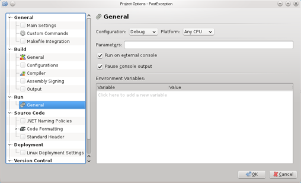

Ahí seleccionamos la opción Run on external console, ahora al ejecutar el programa el resultado se verá en una ventana terminal independiente como en la siguiente imagen que muestra el resultado sin ninguna excepción.

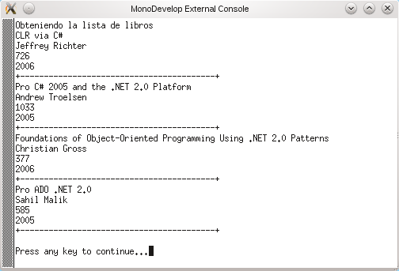

Sin embargo si ocurre una excepción relacionada con la base de datos se mostrará la salida como en la siguiente imagen.

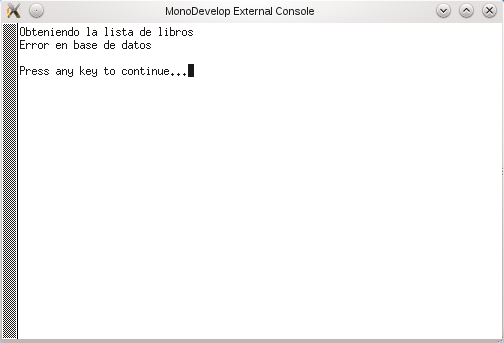

Si hay una excepción en la aplicación se mostrará el resultado como en la siguiente imagen.

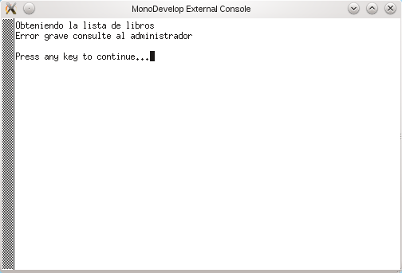

La técnica de custom exceptions permite la separación entre el código de flujo de la aplicación y el código de manejo de excepciones lo que hace la aplicación cumpla con un mecanismo mínimo de calidad y sea mucho más manejable, robusta y escalable.

Aqui el archivo <i>App.config</i> donde se encuentra la cadena de conexion (ConnectionString) y  se accede a su valor mediante la siguiente linea en la aplicacion y se asigna a la variable <tt>connStr</tt>.

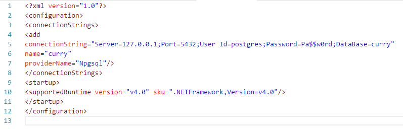